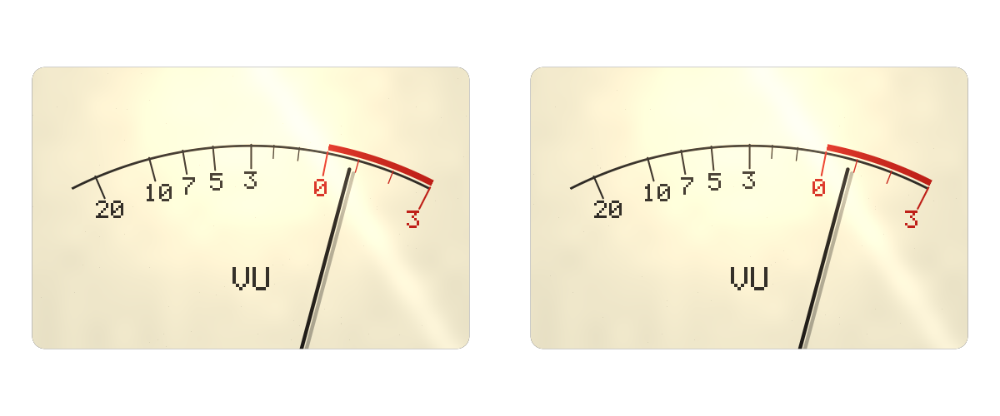
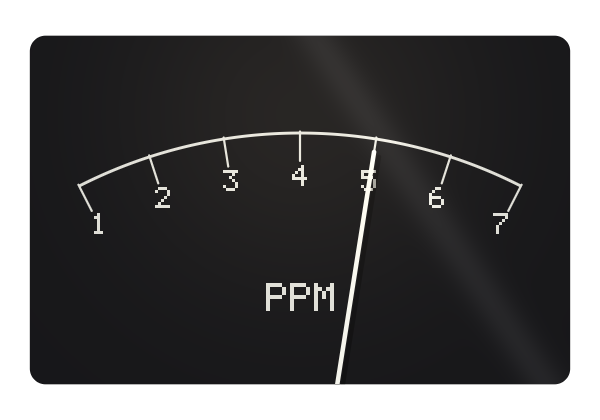
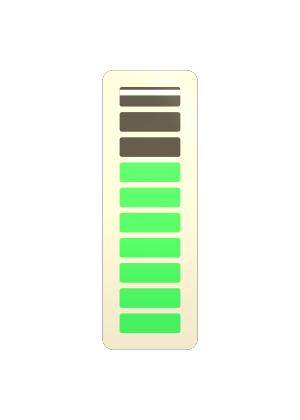

# needle

> **AI-assisted project.** This codebase was created with [Claude](https://claude.com/claude-code)
> (Anthropic), directed and reviewed by a human author. The central claim is a
> number out of a standard, so it is *measured* rather than asserted, and
> measured against the CPU engine rather than against rendered pixels: a step to
> 0 VU reaches 99 % of its deflection in **300.000 ms** and overshoots by
> **1.2500 %** (`ndtest --ballistics`), a PPM falls 20 dB in **2.800000 s**
> (`--ppm`), and the bargraph's ten thresholds — recovered by bisecting on the
> input, not read back from the code that set them — are **3.000000 dB** apart
> (`--steps`). Every one of the 31 controls is proven to change the picture, and
> the bundle registers, instantiates and lights pixels under the fleet's oxbow
> host. **It has never been loaded into Resolume.**

Audio meters with the ballistics their standards actually specify, drawn live at
the output's own raster. An FFGL **source** plugin for Resolume Arena and Avenue.

A stereo pair just past 0 VU, rendered by the plugin's own offline harness
(`ndtest`), not captured from Resolume.

## The one idea

**The movement is not a free choice.**

A VU meter is a d'Arsonval movement — a mass on a spring with viscous damping —
which is a second-order system with exactly two free parameters. ANSI C16.5 says
two things about it: a step to 0 VU reaches 99 % of its deflection in 300 ms, and
it overshoots by between 1.0 % and 1.5 %. Two statements about a two-parameter
system leave nothing to taste. So needle solves for them, in code, from the
quoted figures:

    zeta = 0.812716986      omega_n = 13.5119 rad/s  (2.1505 Hz)

and if you change the quoted figure, the movement changes. Nothing here was
tuned until it looked right.

The same discipline everywhere else. A peak programme meter's 20 dB of fall-back
in 2.8 s *is* a time constant, because an exponential decay in amplitude is a
straight line in decibels: `T = 2.8/ln 10 = 1.2160 s`. Its 5 ms integration
figure gives `T = 3.1616 ms`. The LM3915's ladder is three decibels a rung and
ten rungs.

### What falls out

- **The needle overshoots a kick and settles back** — because 1.25 % of overshoot
  is what the standard asks for, not because an ease-out looked nice.
- **0 VU sits at 71 % of the arc**, not at 87 %, because a VU scale is linear in
  *voltage* and the scale runs to +3. A BBC PPM's marks are evenly spaced because
  its scale is linear in decibels. Get that backwards and you have a meter that
  reads correctly at exactly two points.
- **A hold bar sits above the bargraph's column** and comes down at a rate you
  choose — because nobody standardised that one, and the plugin says so.
- **The magic eye's wings overlap at overload**, which is the thing anyone who
  has used one actually watches for.
- **Wear stops the pointer short rather than slowing it down.** A worn pivot is
  dry friction, not more damping, and the two behave nothing alike: a damped
  movement still arrives, a dry one stops somewhere inside a dead band and stays
  there — at a different place depending on which way it came. That is why
  people tap a tired meter, and at Wear 1 this one rests 2.0 % of full scale
  short, both ways.

### The four instruments

| | |
|---|---|
|  |  |
| **PPM** — IEC 60268-10 type II. Seven marks, four decibels apart, no red band: a PPM says where the peak is and leaves the judgement to you. | **Bargraph** — the LM3915's 3 dB ladder, ten steps, with a peak hold bar. |

**Magic eye** — a 6U5, with a shadow that closes as the level rises, a warm-up
from cold, phosphor persistence, and a target you can wear out.

## Controls

- **Meter** — Type (VU / PPM / Bargraph / Magic Eye), Count (mono or a stereo
  pair), Reference Level (the dBFS the meter calls zero, −18 by default),
  Sensitivity (±12 dB of trim), Bin Law, and **Standard**.
- **Ballistics** — Rise, Fall, Overshoot, Peak Hold, Hold Decay. With **Standard**
  on, the first three are *out of the model entirely*: every constant comes from
  the specification. With it off they are yours, and the result is deliberately
  not a movement any more — a rise that differs from a fall is a switched system
  and no mass on a spring does that. Peak Hold and Hold Decay stay live on both
  settings, because no standard specifies them.
- **Look** — Face and Needle colour, Scale Style, Lamp, Glass, Wear, Persistence.
  **Wear** is the only one of those that is not purely cosmetic: as well as
  dirtying the glass and dimming the phosphor it puts dry friction in the pivot.
  At Wear 0, which is the default, the movement is bit-identical to a clean one.
- **Layout** — Size, Position, Rotation, Background, Mix.

Every ballistic default is the value at which Free agrees with Standard for
the quantity it is named after: Rise and Overshoot give the VU's standard
movement, and Fall gives the PPM's standard fall-back (`ndtest --defaults`).
One Rise and one Fall cannot be both meters at once, though, so flipping
Standard off at the defaults is **not** a no-op everywhere: in Free the VU (and
the magic eye) falls over the PPM's 2.8 s instead of its own 300 ms, and the PPM
rises over the VU's 300 ms instead of its own few milliseconds. The switch
alone leaves the VU's rise and the PPM's fall exactly where they were.

## What it reads, and what it cannot

Resolume gives an FFGL plugin one thing: a 64-bin spectrum, once per frame.
needle takes its level as the square root of the sum over **all** of those bins,
which by Parseval's theorem is the signal's power however the bins happen to be
laid out in frequency — so the fleet's long-standing and untested assumption that
they run linearly to Nyquist is one this plugin does not have to make.

Three honest limits follow, and none of them is hidden:

- **The calibration is nominal.** Whether a full-scale sine produces a bin of 1.0
  depends on the host's window and normalisation, which nothing here can
  discover. Reference Level and Sensitivity are how you put the needle where
  your programme actually sits.
- **It is not a true-peak meter.** A magnitude spectrum has no phase, so the
  time-domain peak inside the block cannot be recovered from it. The PPM and the
  bargraph are driven by a block RMS: on a sine that is 3.01 dB below a real PPM,
  and on peakier material it is further below by that material's crest factor.
  The *ballistics* are the standard's, exactly. The *detector* is not.
- **A stereo pair is two instruments on one spectrum.** FFGL has one audio buffer
  to give, so both meters read the programme. A pair of VUs is the instrument
  people recognise; it is not two measurements.

## Status

**v0.1.0, 2026-09-22, and honestly early.**

Verified, by measurement on this machine (Apple Silicon, macOS 26.4):

- **ANSI C16.5.** 99 % of a step at **300.000 ms** (allowed 300 ± 5), overshoot
  **1.2500 %** (allowed 1.0–1.5). The oversampled integrator tracks the exact
  closed-form step response to better than **1e-12** of full scale.
- **IEC 60268-10 type II.** 20 dB of fall-back in **2.800000 s** (allowed
  2.8 ± 0.05); a 5 ms burst reads **2.000000 dB** below the same tone held.
- **The LM3915 ladder.** Ten thresholds recovered by bisecting on the input,
  every gap **3.000000 dB**, the top rung exactly at the reference and the bottom
  at −27.000 dB.
- **The magic eye.** The shadow never widens as the level rises across a 60 dB
  sweep, is 100° wide open, is shut at the stated overload to seventy times finer
  than one pixel of arc at 4K, and the wings overlap 15° at +6 dB.
- **Frame one.** A clip triggered at t = 40 s integrates nothing on its first
  frame and reaches 99 % at **300.24 ms** — the same, to 2.5 µs, as one triggered
  at zero.
- **Frame rate.** Half a second of the same signal reads **0.712908590** at 24,
  30, 50, 60 and 144 fps, with a spread of exactly zero.
- **A worn pivot.** At Wear 1 the pointer stops dead **2.0 % of full scale**
  short of its target, inside the 3 % dead band the friction implies, and at a
  different place depending on which way it came. At Wear 0 it is bit-identical
  to a frictionless movement at every one of 9,600 steps.
- **The picture.** Pixel-exact draws at 640×360 and 1920×1080; all **31**
  controls change it; the bundle is universal, exports `plugMain`, signs, and
  passes `oxbow selftest` as `ND01` / Needle / source.
- **Cost**, `ndtest --bench`: **under 0.03 ms/frame at every raster from 720p to
  4K**, which is under a fifth of one per cent of a 60 fps frame. That is as
  precise as the measurement honestly gets: one pass is so cheap that the number
  is dominated by scheduling rather than by the shader, and back-to-back passes
  at 4K have spanned 0.020 to 0.077 ms on an otherwise idle machine. The bench
  quotes its fastest pass of five with the spread printed beside it; a single
  average there would be measuring the machine's mood.

Not verified, and not pretended:

- **Never loaded into Resolume**, and not installed into it. Everything above is
  the offline harness driving the real plugin class in a headless GL context.
  How 31 controls across four groups present in Resolume's inspector is
  untested.
- **Three of the quoted figures came from background knowledge and were not
  checked against a document**: the PPM's "2 dB below steady for a 5 ms burst"
  (used in place of the looser "about 80 %" — they are the same requirement,
  since 10^(−2/20) is 79.43 %), the BBC PPM's seven marks at four decibels, and
  the 6U5's 100-degree shadow angle. `AGENTS.md` separates those from the
  figures that were supplied, and each names the single constant to change if it
  turns out to be wrong. Only the first can affect a ballistic claim.
- **Windows is CI-only and the CI has never run.**
- **The host's audio buffer is uncalibrated and its bin law is unmeasured** — see
  above. `Bin Law` exists because the fleet disagrees with itself about it.
- **Text is pixel-exact only at Rotation 0.** Rotate the instrument and the
  labels are resampled.
- No factory presets, no OpenFX port, no browser demo, no user guide, no release.

## Installing

Copy `Needle.bundle` (macOS) or `Needle.dll` (Windows) into

    ~/Documents/Resolume Arena/Extra Effects        (or "Resolume Avenue")
    Documents\Resolume Arena\Extra Effects           (Windows)

and restart Resolume. It appears under **Sources**.

## Building

    git clone --recursive https://github.com/stoatworks-labs/needle
    cmake -B build -DCMAKE_BUILD_TYPE=Release
    cmake --build build
    cmake --install build          # into Arena's Extra Effects, macOS

The macOS build is universal (arm64 + x86_64) by default; add
`-DCMAKE_OSX_ARCHITECTURES=arm64` for a faster development build. Windows needs
GLEW from vcpkg — see `.github/workflows/release.yml` for the exact configure
line.

## Building and testing

The offline harness drives the real plugin class. Nine of its eleven check groups
open **no GL context at all**, because the claims they make are claims about a
differential equation and a rasteriser has no opinion about those:

    ./build/ndtest --ballistics     # ANSI C16.5, solved and measured
    ./build/ndtest --ppm            # IEC 60268-10 type II
    ./build/ndtest --steps          # the 3 dB ladder, by bisection
    ./build/ndtest --eye            # the shadow, across a 60 dB sweep
    ./build/ndtest --prime          # frame one, and a clip trigger at t = 40 s
    ./build/ndtest --rate           # 24, 30, 50, 60 and 144 fps agree
    ./build/ndtest --friction       # a worn pivot, and what it does not touch
    ./build/ndtest --pixels         # and the one check that reads a rasteriser
    ./build/ndtest --bench          # 720p through 4K
    ./build/ndtest --out /tmp/f.png --size 1920x1080 --level -18 --set "Type=1"
    python3 tools/sweep.py          # no control is silently dead
    tools/verify.sh                 # all of it, in about nine seconds

## Diagnostics

needle writes a plain-text log every time it runs:

    ~/Library/Logs/needle/needle.YYYY-MM-DD.log                          (macOS)
    %LOCALAPPDATA%\needle\logs\needle.YYYY-MM-DD.log                     (Windows)
    ${XDG_STATE_HOME:-~/.local/state}/needle/logs/needle.YYYY-MM-DD.log

It records the build, the GL driver, the solved ballistic constants, what unit
the host's clock turned out to be, and whether any audio reached the layer — the
last of which is the commonest reason a meter does not move.

<!-- attributions:start -->
This project is built on other people's work — see [ATTRIBUTIONS.md](ATTRIBUTIONS.md).
<!-- attributions:end -->

## Licence

MIT. See [LICENSE](LICENSE).

The specifications the ballistics are solved from — ANSI C16.5, IEC 60268-10,
the LM3915's divider chain, the 6U5's shadow angle — are published numbers, not
anybody's source. Nothing was copied from any implementation of them.
